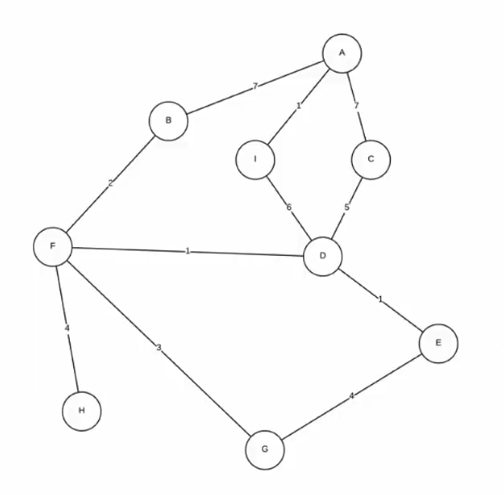
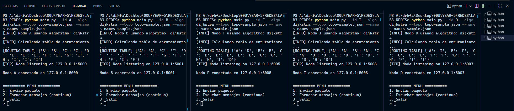
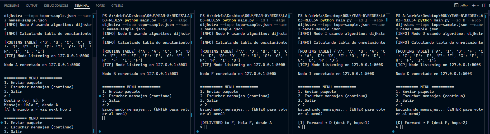

# LAB3-REDES

## Estructura de Proyecto

```bash
LAB3-REDES/
│
├── main.py              # Inicia un nodo
├── network/
│   ├── transport.py     # TCP / XMPP
│   ├── protocol.py      # Definición de paquetes JSON
│   └── topo_loader.py   # Cargar topología y nombres
│
├── routing/
│   ├── base.py          # Clase base de algoritmos
│   ├── dijkstra.py      # Implementación de Dijkstra
│   ├── flooding.py      # Implementación de flooding
│   └── link_state.py    # Implementación de link_state
│
├── topo-sample.json
└── names-sample.json
```

## Topología implementada
En un principio se está utilizando esta topología que se dió como ejemplo para hacer pruebas, la definición de ella está en [topo-sample.json](topo-sample.json)
Cada nodo arista tiene asignado un peso, el cuál será utilizado como parámetro en los 3 algoritmos implementados.



## Ejecución y Ejemplo

Como ejemplo de ejecución y funcionamiento, se hará enviará un mensaje `A` → `F`, para ello al iniciar un nodo, este calculará la `ROUTING TABLE` para todos los nodos de la topología: Por ejemplo, con el algoritmo de `Dijkstra` el nodo A tiene esta tabla `[ROUTING TABLE] {'B': 'B', 'C': 'C', 'D': 'I', 'E': 'I', 'F': 'I', 'G': 'I', 'H': 'I', 'I': 'I'}`, la cuál se interpreta de la siguiente manera:
|Destino|Vía|
|-----|-----|
|**B**|**B** (Vecino)|
|**C**|**C** (Vecino)|
|**D**|**I**|
|**E**|**I**|
|**F**|**I**|
|**G**|**I**|
|**H**|**I**|
|**I**|**I**|
> Para este ejemplo se generarán únicamente los nodos `A`, `B`, `D`, `F`, `I`
Adicionalmente estas son las otras tablas generadas:
* **B**: {'A': 'A', 'C': 'F', 'D': 'F', 'E': 'F', 'F': 'F', 'G': 'F', 'H': 'F', 'I': 'F'}
* **D**: {'A': 'I', 'B': 'F', 'C': 'C', 'E': 'E', 'F': 'F', 'G': 'F', 'H': 'F', 'I': 'I'}
* **F**: {'A': 'D', 'B': 'B', 'C': 'D', 'D': 'D', 'E': 'D', 'G': 'G', 'H': 'H', 'I': 'D'}
* **I**: {'A': 'A', 'B': 'A', 'C': 'A', 'D': 'D', 'E': 'D', 'F': 'D', 'G': 'D', 'H': 'D'}

Tomando en cuenta las tablas, sabemos que la trayectoría para `A` → `F` sería la siguiente:
`A` → `I` → `D` → `F`. Ahora que sabemos el camino esperado, ejecutaremos el programa para visualizar el traspaso de mensaje.

1. Para inicializar los nodos, se siguie la siguiente estructura:

```bash
python main.py --id <ID del nodo> --algo <Nombre del algoritmo> --topo topo-sample.json --names names-sample.json
```

Entonces aplicándolo con lo implementado hasta ahora, para levantar la demostración

```bash
python main.py --id A --algo dijkstra --topo topo-sample.json --names names-sample.json
python main.py --id B --algo dijkstra --topo topo-sample.json --names names-sample.json
python main.py --id F --algo dijkstra --topo topo-sample.json --names names-sample.json
python main.py --id I --algo dijkstra --topo topo-sample.json --names names-sample.json
python main.py --id D --algo dijkstra --topo topo-sample.json --names names-sample.json
```

Por lo que tendrán algo parecido a lo siguiente:


2. En el caso del nodo `A`, seleccionar la opción **``1. Enviar paquete``**, y para el resto la opción **`2. Escuchar mensajes`**.

3. En la terminal del nodo A, ingresar como destino el nodo `F` y luego ingresar un mensaje, al enviarlo se verá un resultado como el siguiente:



Como se puede observar en varios nodos, se imprimió el proceso o trayectoria que siguió el mensaje hasta llegar al nodo `F`:
```python
Nodo A: [A] Enviado a F via next hop I          # Indica que primero hizo hop hacia I
Nodo B: No se utilizó                           # Este nodo no se utilizó para llegar a F
Nodo I: [I] Forward → D (dest F, hops=1)        # En este punto el hop es 1, y que ahora va hacia D
Nodo D: [D] Forward → F (dest F, hops=2)        # Ahora el hop acumulado es 2, y va hacia F
Nodo F: [DELIVERED to F] Hola F, desde A        # Finalmente llegó el mensaje desplegándolo en consola.
```

4. Ahora en teoría, si se elimina el nodo I entonces programa debe de recalcular la tabla con los nodos disponibles y así encotrar la nueva mejor ruta de `A` → `F`: